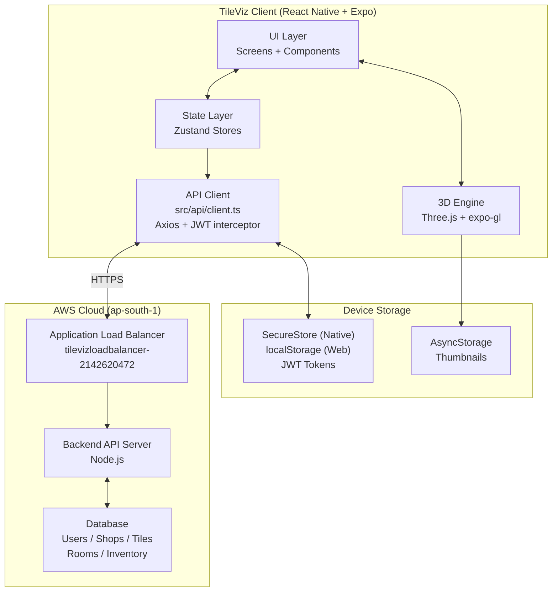
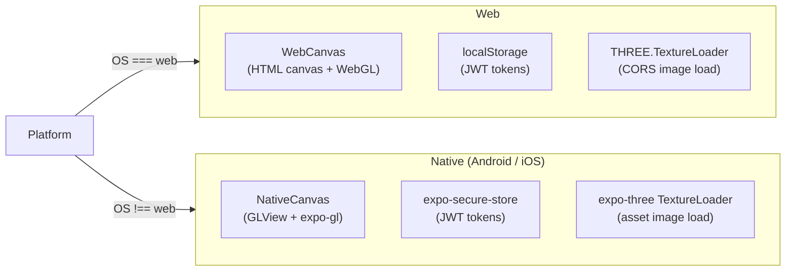

# System Architecture Diagram

```mermaid
graph TB
    subgraph Client["TileViz Client (React Native + Expo)"]
        UI["UI Layer\nScreens + Components"]
        STATE["State Layer\nZustand Stores"]
        THREE["3D Engine\nThree.js + expo-gl"]
        APICLIENT["API Client\nsrc/api/client.ts\nAxios + JWT interceptor"]
    end

    subgraph AWS["AWS Cloud (ap-south-1)"]
        LB["Application Load Balancer\ntilevizloadbalancer-2142620472"]
        BACKEND["Backend API Server\nNode.js"]
        DB["Database\nUsers / Shops / Tiles\nRooms / Inventory"]
    end

    subgraph Storage["Device Storage"]
        SECURE["SecureStore (Native)\nlocalStorage (Web)\nJWT Tokens"]
        LOCAL["AsyncStorage\nThumbnails"]
    end

    UI <--> STATE
    UI <--> THREE
    STATE --> APICLIENT
    APICLIENT <-->|HTTPS| LB
    LB --> BACKEND
    BACKEND <--> DB
    APICLIENT <--> SECURE
    THREE --> LOCAL
```

---

## Platform Differences

```mermaid
graph LR
    subgraph Web
        WC["WebCanvas\n(HTML canvas + WebGL)"]
        LS["localStorage\n(JWT tokens)"]
        TL["THREE.TextureLoader\n(CORS image load)"]
    end

    subgraph Native["Native (Android / iOS)"]
        NC["NativeCanvas\n(GLView + expo-gl)"]
        SS["expo-secure-store\n(JWT tokens)"]
        ETL["expo-three TextureLoader\n(asset image load)"]
    end

    Platform -->|OS === web| Web
    Platform -->|OS !== web| Native
```
