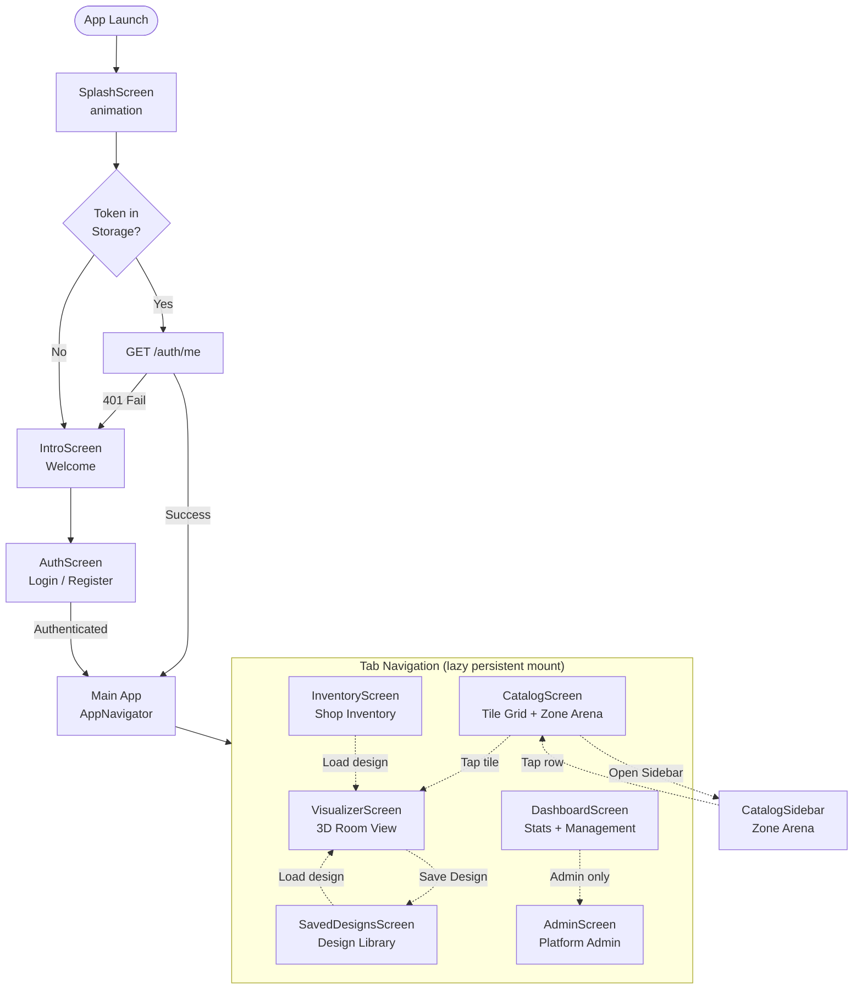

# Screen Navigation Flow



---

## Screen Persistence

```mermaid
stateDiagram-v2
    [*] --> Visualizer : app opens (default)
    Visualizer --> Catalog : tap tab
    Catalog --> Visualizer : tap tab
    Catalog --> Saved : tap tab
    Saved --> [*] : screen NEVER unmounts\nonce visited
    note right of Saved : display:none hides it\nbut keeps it mounted\nand data in memory
```
