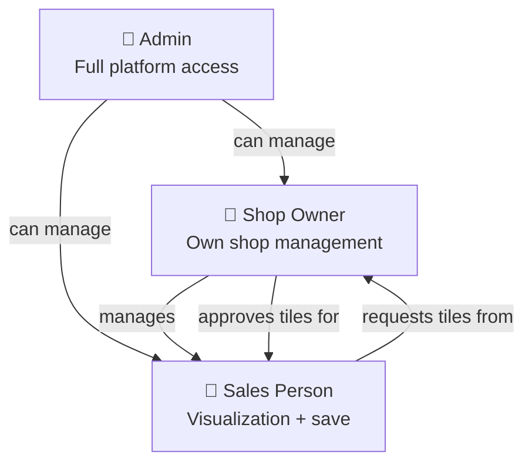

# Role Permissions Matrix

## Screen Access

| Screen | Admin | Shop Owner | Sales Person |
|---|:---:|:---:|:---:|
| Visualizer | ✅ | ✅ | ✅ |
| Catalog | ✅ | ✅ | ✅ |
| Saved Designs | ✅ | ✅ | ✅ |
| Inventory | ✅ | ✅ | ✅ |
| Dashboard | ✅ | ✅ | ❌ |
| Admin Panel | ✅ | ❌ | ❌ |

## Feature Access

| Feature | Admin | Shop Owner | Sales Person |
|---|:---:|:---:|:---:|
| Create visualization | ✅ | ✅ | ✅ |
| Save design | ✅ | ✅ | ✅ |
| Save to inventory | ✅ | ✅ | ✅ |
| Delete inventory item | ✅ | ✅ | ❌ |
| Request tile to catalog | ❌ | ❌ | ✅ |
| Approve tile requests | ❌ | ✅ | ❌ |
| Manage sales persons | ❌ | ✅ | ❌ |
| View all shops | ✅ | ❌ | ❌ |
| Toggle user active/inactive | ✅ | ❌ | ❌ |
| View platform-wide stats | ✅ | ❌ | ❌ |
| View shop-level stats | ❌ | ✅ | ❌ |

## Data Visibility

| Data | Admin | Shop Owner | Sales Person |
|---|---|---|---|
| Tiles | All shops' approved tiles | Own shop's approved tiles | Own shop's approved tiles |
| Inventory | All shops | Own shop | Own shop |
| Saved Designs | Own designs | Own designs | Own designs |
| Users | All platform users | Own shop's users | — |
| Shops | All shops | Own shop | — |

