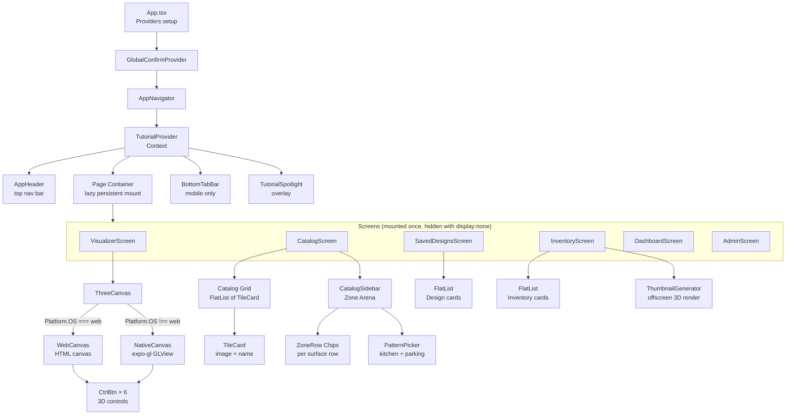

# Component Hierarchy



---

## Shared Components

```
Button          → used in: all screens
SearchBar       → used in: SavedDesigns, Inventory
RoleBadge       → used in: Dashboard, Admin
SkeletonLoader  → used in: loading states
SaveDesignModal → used in: Visualizer, Catalog
TileVizLogo     → used in: AppHeader, IntroScreen
FormInput       → used in: AuthScreen
```
