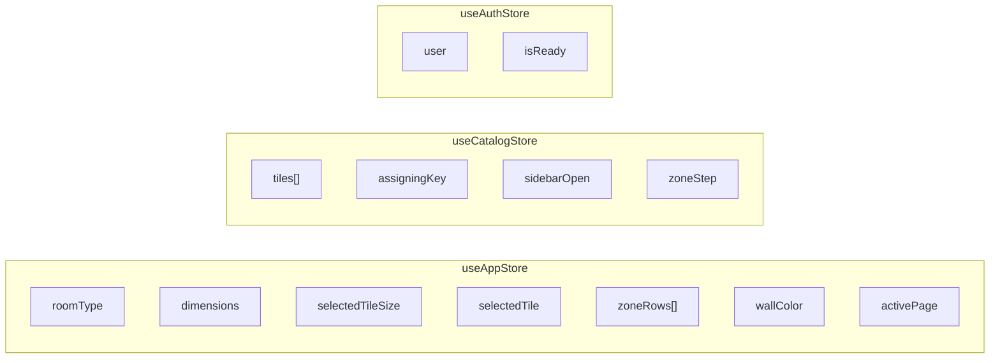
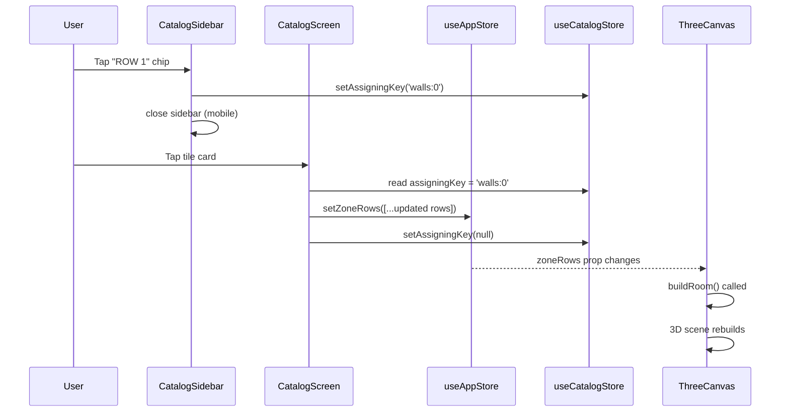
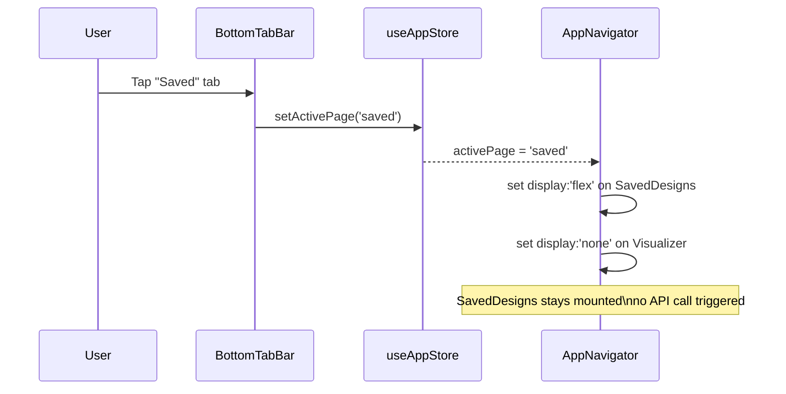

# Zustand State Flow

## Store Ownership

```mermaid
graph LR
    subgraph APP["useAppStore"]
        RT["roomType"]
        DIM["dimensions"]
        TS["selectedTileSize"]
        TILE["selectedTile"]
        ZR["zoneRows[]"]
        WC["wallColor"]
        AP["activePage"]
    end

    subgraph CAT["useCatalogStore"]
        TILES["tiles[]"]
        AK["assigningKey"]
        SO["sidebarOpen"]
        ZS["zoneStep"]
    end

    subgraph AUTH["useAuthStore"]
        USER["user"]
        READY["isReady"]
    end
```

## Data Flow: Tile Assignment

```mermaid
sequenceDiagram
    participant U as User
    participant CS as CatalogSidebar
    participant CAT as CatalogScreen
    participant AS as useAppStore
    participant CS2 as useCatalogStore
    participant TC as ThreeCanvas

    U->>CS: Tap "ROW 1" chip
    CS->>CS2: setAssigningKey('walls:0')
    CS->>CS: close sidebar (mobile)

    U->>CAT: Tap tile card
    CAT->>CS2: read assigningKey = 'walls:0'
    CAT->>AS: setZoneRows([...updated rows])
    CAT->>CS2: setAssigningKey(null)

    AS-->>TC: zoneRows prop changes
    TC->>TC: buildRoom() called
    TC->>TC: 3D scene rebuilds
```

## Data Flow: Screen Navigation

```mermaid
sequenceDiagram
    participant U as User
    participant BTB as BottomTabBar
    participant AS as useAppStore
    participant AN as AppNavigator

    U->>BTB: Tap "Saved" tab
    BTB->>AS: setActivePage('saved')
    AS-->>AN: activePage = 'saved'
    AN->>AN: set display:'flex' on SavedDesigns
    AN->>AN: set display:'none' on Visualizer
    Note over AN: SavedDesigns stays mounted\nno API call triggered
```
