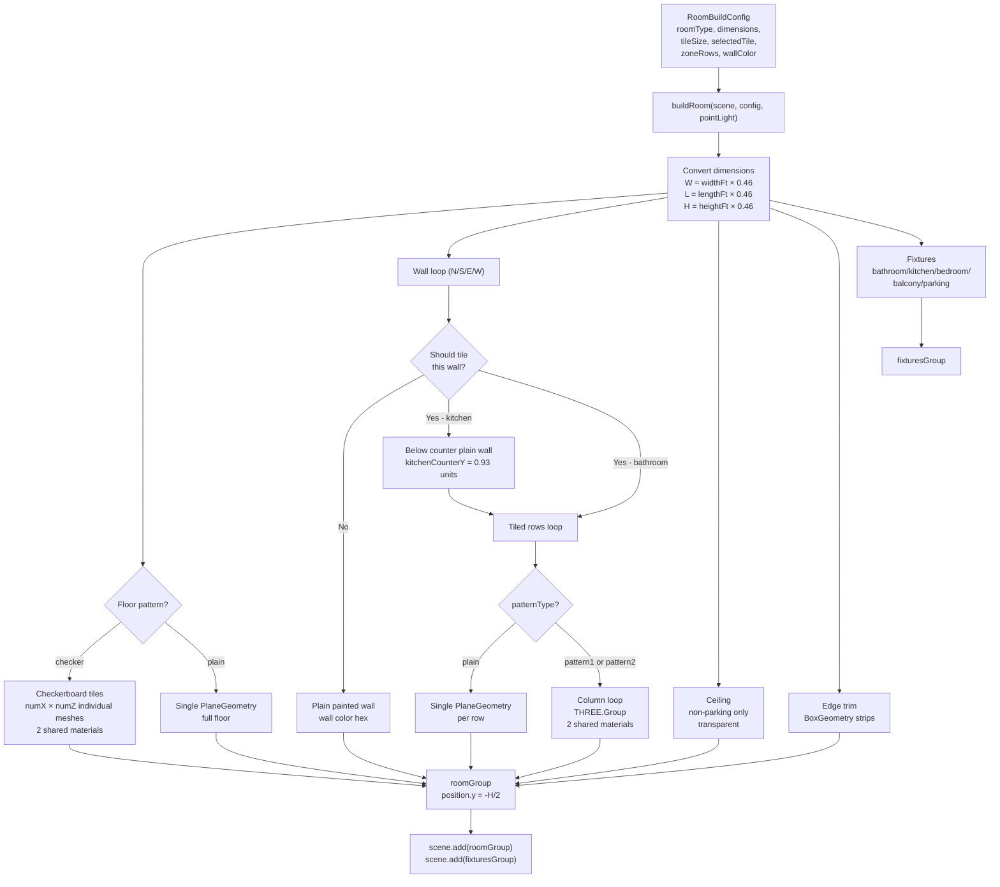
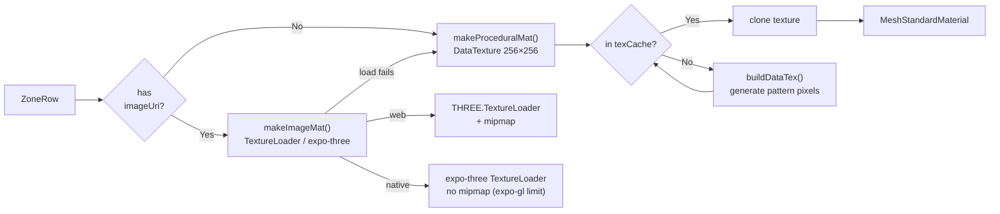

# 3D Scene Build Flow

## Full Pipeline

```mermaid
flowchart TD
    CFG["RoomBuildConfig\nroomType, dimensions,\ntileSize, selectedTile,\nzoneRows, wallColor"]

    CFG --> BR["buildRoom(scene, config, pointLight)"]

    BR --> SCALE["Convert dimensions\nW = widthFt × 0.46\nL = lengthFt × 0.46\nH = heightFt × 0.46"]

    SCALE --> FLOOR{"Floor pattern?"}
    FLOOR -->|checker| CHECKER["Checkerboard tiles\nnumX × numZ individual meshes\n2 shared materials"]
    FLOOR -->|plain| FPLAIN["Single PlaneGeometry\nfull floor"]

    SCALE --> WALLS["Wall loop (N/S/E/W)"]

    WALLS --> WTILE{"Should tile\nthis wall?"}
    WTILE -->|No| WPLAIN["Plain painted wall\nwall color hex"]
    WTILE -->|Yes - kitchen| COUNTER["Below counter plain wall\nkitchenCounterY = 0.93 units"]
    COUNTER --> ROWS["Tiled rows loop"]
    WTILE -->|Yes - bathroom| ROWS

    ROWS --> PT{"patternType?"}
    PT -->|plain| ROWMESH["Single PlaneGeometry\nper row"]
    PT -->|pattern1 or pattern2| COLLOOP["Column loop\nTHREE.Group\n2 shared materials"]

    SCALE --> CEILING["Ceiling\nnon-parking only\ntransparent"]
    SCALE --> TRIM["Edge trim\nBoxGeometry strips"]
    SCALE --> FIX["Fixtures\nbathroom/kitchen/bedroom/\nbalcony/parking"]

    ROWMESH --> GROUP["roomGroup\nposition.y = -H/2"]
    COLLOOP --> GROUP
    CHECKER --> GROUP
    FPLAIN --> GROUP
    WPLAIN --> GROUP
    CEILING --> GROUP
    TRIM --> GROUP
    FIX --> FIXGROUP["fixturesGroup"]

    GROUP --> SCENE["scene.add(roomGroup)\nscene.add(fixturesGroup)"]
```

## Material Resolution

```mermaid
flowchart LR
    ZR["ZoneRow"] --> URI{"has\nimageUri?"}
    URI -->|Yes| IMG["makeImageMat()\nTextureLoader / expo-three"]
    URI -->|No| PROC["makeProceduralMat()\nDataTexture 256×256"]

    IMG -->|load fails| PROC
    IMG -->|web| WTEX["THREE.TextureLoader\n+ mipmap"]
    IMG -->|native| NTEX["expo-three TextureLoader\nno mipmap (expo-gl limit)"]

    PROC --> CACHE{"in texCache?"}
    CACHE -->|Yes| CLONE["clone texture"]
    CACHE -->|No| BUILD["buildDataTex()\ngenerate pattern pixels"]
    BUILD --> CACHE
    CLONE --> MAT["MeshStandardMaterial"]
```
