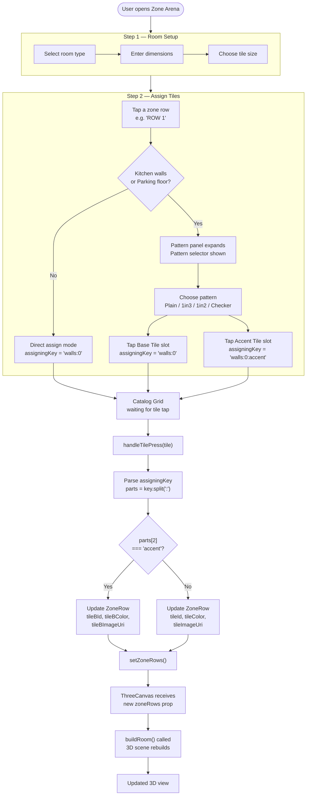

# Tile Assignment Flow

## Zone Arena → 3D Update



## assigningKey Format Reference

```
'floor:0'           → Floor base tile
'floor:0:accent'    → Floor accent tile (checker pattern)
'walls:0'           → All walls row 0 base tile
'walls:0:accent'    → All walls row 0 accent tile
'walls:2'           → All walls row 2 base tile
'wall_n:1'          → North wall only, row 1 base tile
```
