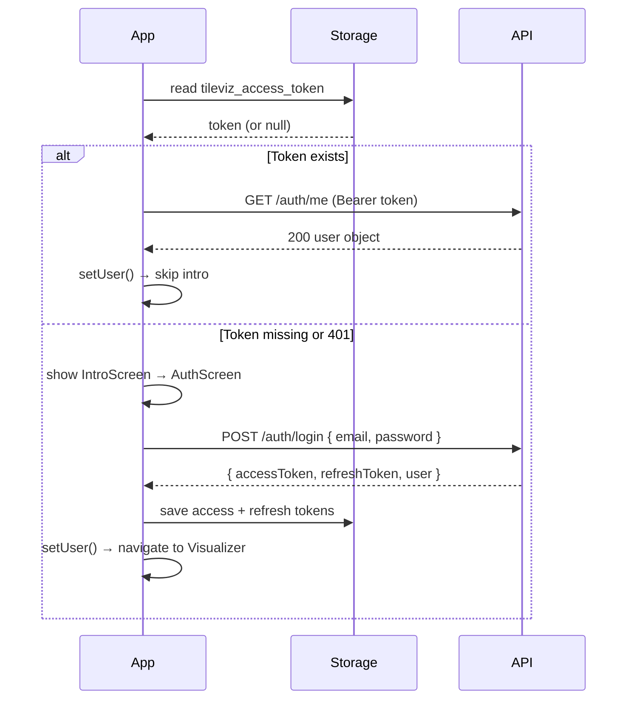
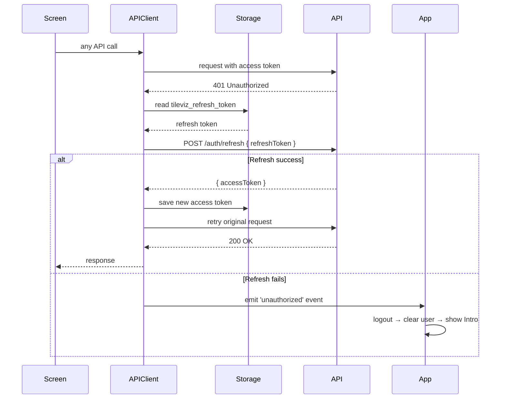
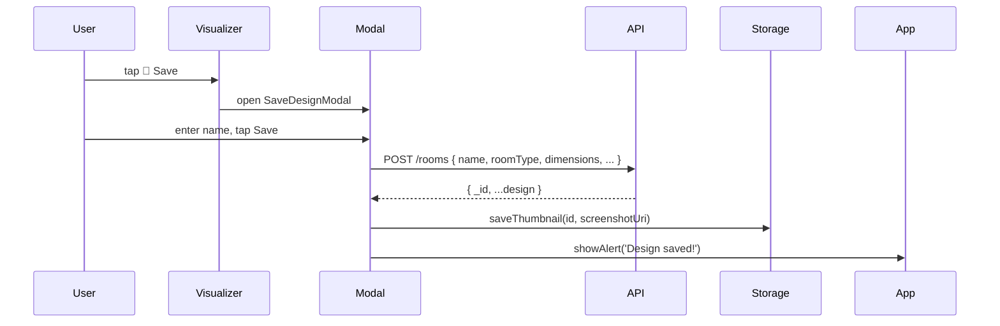
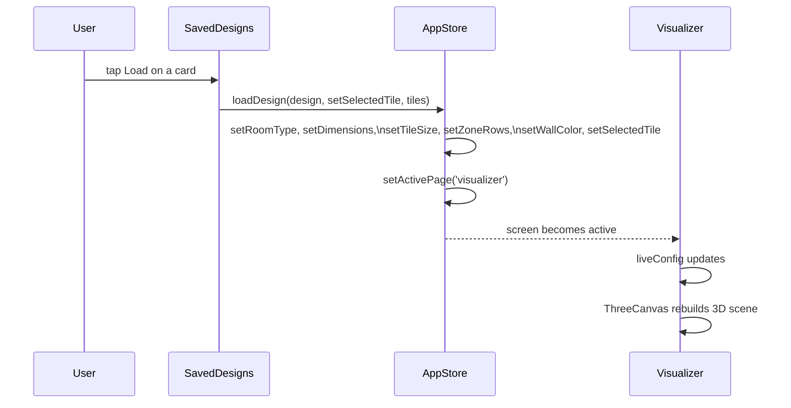

# API Sequence Diagrams

## Login Flow

```mermaid
sequenceDiagram
    participant App
    participant Storage
    participant API

    App->>Storage: read tileviz_access_token
    Storage-->>App: token (or null)

    alt Token exists
        App->>API: GET /auth/me (Bearer token)
        API-->>App: 200 user object
        App->>App: setUser() → skip intro
    else Token missing or 401
        App->>App: show IntroScreen → AuthScreen
        App->>API: POST /auth/login { email, password }
        API-->>App: { accessToken, refreshToken, user }
        App->>Storage: save access + refresh tokens
        App->>App: setUser() → navigate to Visualizer
    end
```

## Token Refresh (Auto)

```mermaid
sequenceDiagram
    participant Screen
    participant APIClient
    participant Storage
    participant API

    Screen->>APIClient: any API call
    APIClient->>API: request with access token
    API-->>APIClient: 401 Unauthorized

    APIClient->>Storage: read tileviz_refresh_token
    Storage-->>APIClient: refresh token

    APIClient->>API: POST /auth/refresh { refreshToken }

    alt Refresh success
        API-->>APIClient: { accessToken }
        APIClient->>Storage: save new access token
        APIClient->>API: retry original request
        API-->>APIClient: 200 OK
        APIClient-->>Screen: response
    else Refresh fails
        APIClient->>App: emit 'unauthorized' event
        App->>App: logout → clear user → show Intro
    end
```

## Save Design Flow

```mermaid
sequenceDiagram
    participant User
    participant Visualizer
    participant Modal
    participant API
    participant Storage

    User->>Visualizer: tap 💾 Save
    Visualizer->>Modal: open SaveDesignModal
    User->>Modal: enter name, tap Save
    Modal->>API: POST /rooms { name, roomType, dimensions, ... }
    API-->>Modal: { _id, ...design }
    Modal->>Storage: saveThumbnail(id, screenshotUri)
    Modal->>App: showAlert('Design saved!')
```

## Load Design Flow

```mermaid
sequenceDiagram
    participant User
    participant SavedDesigns
    participant AppStore
    participant Visualizer

    User->>SavedDesigns: tap Load on a card
    SavedDesigns->>AppStore: loadDesign(design, setSelectedTile, tiles)
    AppStore->>AppStore: setRoomType, setDimensions,\nsetTileSize, setZoneRows,\nsetWallColor, setSelectedTile
    AppStore->>AppStore: setActivePage('visualizer')
    AppStore-->>Visualizer: screen becomes active
    Visualizer->>Visualizer: liveConfig updates
    Visualizer->>Visualizer: ThreeCanvas rebuilds 3D scene
```
