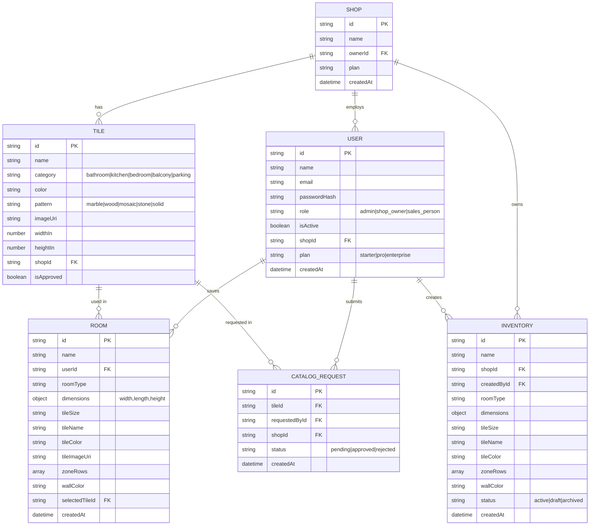

# Entity Relationship Diagram



---

## ZoneRow (embedded in Room / Inventory)

```
ZoneRow {
  wallKey:       'floor' | 'walls' | 'wall_n' | 'wall_s' | 'wall_e' | 'wall_w'
  rowIndex:      number
  tileId:        string (ref → Tile)
  tileName:      string
  tileImageUri:  string
  color:         string (hex)
  patternType:   'plain' | 'pattern1' | 'pattern2' | 'checker'
  tileBId:       string (ref → Tile, accent)
  tileBName:     string
  tileBImageUri: string
  tileBColor:    string (hex)
}
```
